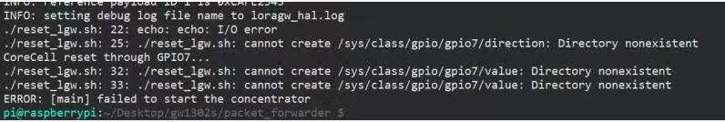
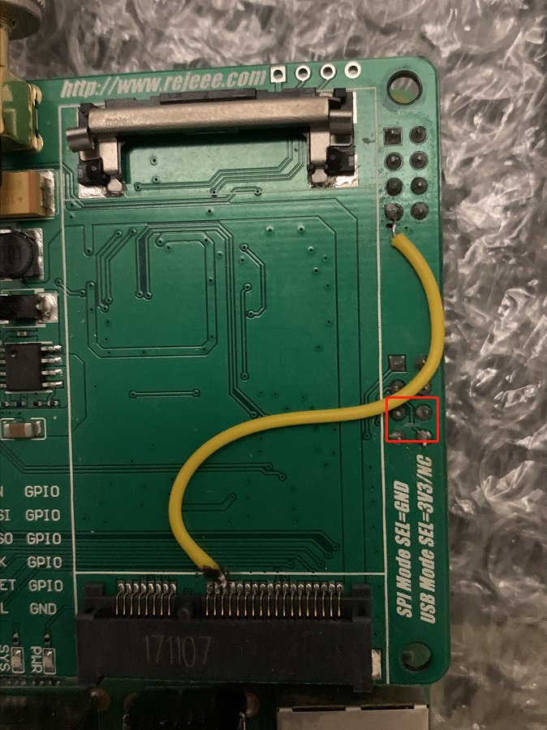
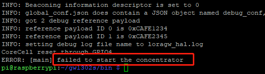

## 前言

GW1302开卖已经一年有余，经历了一段时间的沉淀，先把经常会问到的问题列举和答疑一下

既有利于技术支持提高效率，也能避免开发者们在不断的走前人踩过的坑


## 文档 

原理图和文档已经整理在**doc**文件夹下了


## Q&A

### GPIO7无法导出或者被占用

现象如下：



即执行reset_lgw.sh时出现如上错误提示


原因：

1. 因为GPIO7和SPI0.1的CS叫冲突了，虽然我们实际并没有使用到SPI0.1

   

其实在较早版本的树莓派系统中，这样使用并不会提示冲突，是可以正常使用的，但后面树莓派系统升级之后，会出现此问题


解决办法：

	1. 飞线，并接上述脚本中的引脚号改为所飞的引脚号，下图所飞引脚的引脚号为**4**

2. 使用较早版本的树莓派系统(这个办法就不说了，治标不治本)


飞线的图如下(注意红色方框圈出的地方需要割线)：

 


## 无法启动控制器

现象：



原因：

1. SPI通讯异常
2. reset_lgw.sh未成功执行(上面已经说了，不再赘述)


解决办法:

1. 对于树莓派，请检查spi节点是否开启，树莓派默认未使能SPI，使能的办法

   ```shell
   sudo raspi-config
   
   将interface中的SPI enable
   ```

## LoRaWAN使用上的问题

抱歉，此类问题我们无法提供技术支持，只能靠您自行探索了，当然您也可以在群里试着提问，说不定会有热心群友一起探讨

给您提供一些资料，说不定能帮到您

- [lora-alliance](https://lora-alliance.org/) ，lora联盟的官网，此处您可以找到lorawan的协议文档
- [LoRaMac-node](https://github.com/Lora-net/LoRaMac-node), LoRaWAN 节点端代码
- [lora-net](https://github.com/Lora-net),semtech在github上的关于lora的开源仓库，通常libloragw为sx130x的驱动库,pkt-fwd为基站与lorawan network server通讯的

控制器程序和协议

## 非树莓派平台问题

抱歉，非树莓派平台的问题我们也无法支持，因为平台众多，我们也鞭长莫及

不过大部分情况下，1302跑不起来都是SPI通讯未调好(经验之谈)